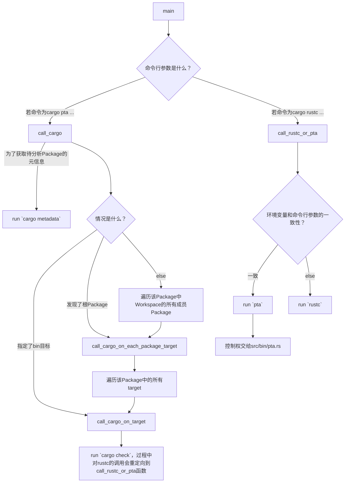
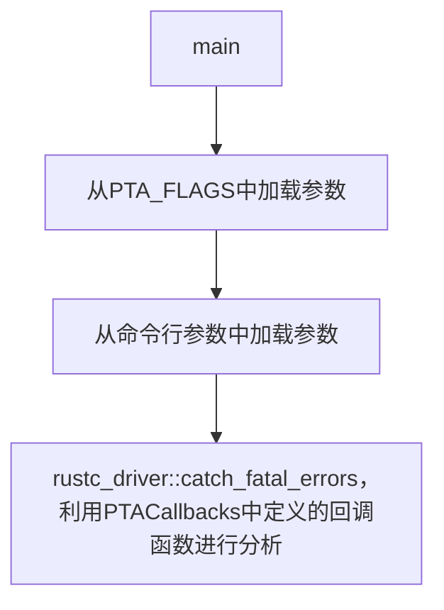
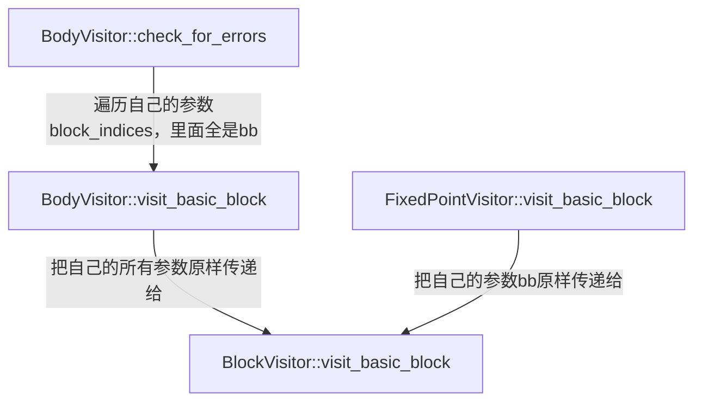

# Rupta代码阅读分析笔记

## rust-analyzer对rustc_private组件报红线的解决方案

[这个问答](https://users.rust-lang.org/t/rust-analyzer-fails-to-index-due-to-unresolved-external-crate-in-a-rustc-private-project/105909) 回答了Rust Analyzer对rustc_private组件报unresolve extern crate的解决方案，总结为4步：

1. 给rustup安装新组件，`rustup component add rustc-dev`

2. 在VS Code的设置中，将`rust-analyzer.rustc.source`设置为`discover`

3. 在当前`crate`包的`Cargo.toml`中填上这样两行：

   ```toml
   [package.metadata.rust-analyzer]
   rustc_private = true
   ```

4. 重启Rust Analyzer

## 自顶向下分析思路

通过`cargo metadata`命令获取关于Rupta crate的元信息。得知该crate有三个编译目标（target）：

- `src/lib.rs` (lib目标)
- `src/bin/cargo-pta.rs` (bin目标)
  - 分析Rust Package时使用的`cargo-pta pta ...`
- `src/bin/pta.rs` (bin目标)
  - 分析单个.rs文件时使用的`pta ...`

## `src/bin/cargo-pta.rs`的分析

按照自顶向下分析思路，我们从这个文件开始分析。



## `src/bin/pta.rs`的分析



该文件的逻辑其实十分简单，其重点就在于`PTACallbacks`的定义，以及`rustc_driver::catch_fatal_errors`的调用。`PTACallbacks`定义于`src/pta/mod.rs`，因此需要进入这个文件进行分析。

## `src/pta/mod.rs`的分析

首先来看看`PTACallbacks`结构体的定义。它只有两个成员：

- `options`：是`AnalysisOptions`结构体，用于配置分析过程的参数。
- `file_name`：待分析（编译）的文件的路径。

简明易懂！然后我们再来看看它是如何实现`rustc_driver::Callbacks`需要的那些回调函数的。

- `config`回调函数：这个简单，接受一个`rustc_interface::interface::Config`参数，将自身的`file_name`设置为该参数记载的源文件名。例如`src/main.rs`。
- `after_analysis`回调函数：这个也很简单，接受一个`rustc_interface::interface::Compiler`参数和一个`rustc_interface::queries::Queries`，对前者进行错误检查（`abort_if_errors`），若无误则对后者执行`enter`方法。该方法接受一个闭包，该闭包接受一个`TyCtxt`，并运行`self.run_pointer_analysis`方法。

我们来瞅瞅`PTACallbacks::run_pointer_analysis`。
- 首先创建并启动了一个`rupta::util::mem_watcher::MemWatcher`。
  - 创建时，尝试获取当前内存占用，并存储到自身。若获取不到，则假设当前内存占用为0。
  - 启动时，每隔100毫秒收取一次系统当前内存占用，然后更新最大值。
- 若找不到入口函数则直接退出；否则构造一个`rupta::mir::analysis_context::AnalysisContext`。根据指定的PTA分析类型不同（CallSiteSensitive模式和Andersen模式）构造不同的分析器（分别是`rupta::pta::context_sensitive::ContextSensitivePTA`和`rupta::pta::andersen::AndersenPTA`），然后调用它们各自的`analyze`方法。

## `src/pta/context_sensitive.rs`的分析

前文提及的`ContextSensitivePTA`分析器结构体的本质是这样定义的：

```rust
pub type CallSiteSensitivePTA<'pta, 'tcx, 'compilation> = ContextSensitivePTA<'pta, 'tcx, 'compilation, KCallSiteSensitive>;
```

也就是说，为`ContextSensitivePTA`的策略（Strategy）泛型参数填入这个`KCallSiteSensitive`即可获得一个`CallSiteSensitivePTA`。上文提及，构造了一个`CallSiteSensitivePTA`之后马上调用了它的`analyze`方法。这个方法内容很简单，除了计时以外，就只做了三件事：`initialize`，`propagate`和计时结束后的`finalize`。

> 由于我们是想从输出的函数调用图入手，查看这个图中的信息是如何一步步被加入的，从而在加入信息的过程中补充加入更多信息，达到获取分析所需信息的目的，因此有必要从函数调用图的生成开始逆向寻找这个往调用图中加信息的过程。
>
> 首先通过查看输出的日志（`PTA_LOG=debug cargo pta ...`）发现有一行这个：`[2024-06-17T13:31:27Z INFO  rupta::util::results_dumper] Dumping call graph...`。搜索可知这行INFO是在`src/util/results_dumper.rs`文件中定义的`dump_results`函数输出的。
>
> 知道了生成调用图的位置，我们可以继续往上追踪到`src/pta/context_sensitive.rs`的`ContextSensitivePTA::finalize`方法中。这个方法只干两件事情：输出函数调用图，输出PTA分析统计结果。
>
> 继续往上追踪，发现这个`finalize`方法在`impl PointerAnalysis for ContextSensitivePTA`的`analyze`方法中被调用。后者的构成在上文中已经讨论完毕。因此，有必要分析调用图数据结构`self.call_graph`是如何在`initialize`和`propagate`方法中被修改的了。

### `initialize`方法及其修改计划

该方法对`self.call_graph`做的唯一改动是增加了入口函数所代表的节点。我们可以以这里为突破口，尝试获取关于函数的更多信息，例如：

- 函数所在的源文件是哪个？
- 函数所属的crate叫什么？
- 函数所属的crate的Cargo.toml文件在哪里？

注意到有一个叫做`AnalysisContext::get_func_id`的方法，它接收一个`DefId`和一个奇怪的泛型参数列表（目前意义不明），能够计算返回一个FuncId。我们去看看这个方法的工作逻辑是怎样的，说不定能受到启发。

在src/pta/context_sensitive.rs的process_reach_funcs中加了输出。

## 总体修改思路

之前，在开题报告中，我们说过我们希望我们的分析工具可以给出如下信息：

```json
{
  "crates": [
    {
      "crate_name": ...,
      "manifest_path": ...
    }, ...
  ],
  "callables": [
    {
      "belongs_to_crate_idx": ...,
      "source_file_path": ...,
      "line_number": ...
    }, ...
  ],
  "calls": [
    {
      "caller_idx": ...,
      "callee_idx": ...
    }, ...
  ]
}
```

我们的总体思路是：

1. crate的信息，可以用`cargo metadata`获取，并且在`src/builder/fpag_builder.rs`中寻找某个函数所属的crate时进行二次验证；
2. callables的信息，在`src/builder/fpag_builder.rs`中已经收集完全了，只不过需要和上一步crate信息对上
3. calls中的信息还不知道从哪里来

### MIRAI的借鉴

由于MIRAI能够输出函数所在的源代码文件路径，而Rupta没有这个机能，所以需要借鉴一下MIRAI是怎么做这件事情的。

根据之前的调研，MIRAI会收集一个数组，内部的元素长这样：`(rustc_span::Span, (DefId, DefId))`，表示在Span中发生了第一个DefId函数调用第二个DefId函数的情况。结果发现可以这样获取函数调用发生的源代码路径：

```rust
// loc的类型就是rustc_span::Span
let source_loc = loc.source_callsite();
if let Ok(line_and_file) = source_map.span_to_lines(source_loc) {
  // line_and_file的类型是FileLines
  // pub struct FileLines {
  //   pub file: Lrc<SourceFile>,
  //   pub lines: Vec<LineInfo>,
  //}
  // 现在已经可以得知该语句的位置了。
}
```

由于我们关心的是函数**定义**发生的位置而不是调用，这里的代码撑死了只能给我们一些方向性的参考。而目前的主要矛盾是：这个`rustc_span::Span`的信息到底是在哪一步中收集获得的呢？

经过简单的搜索，我们发现原来上述`(rustc_span::Span, (DefId, DefId))`信息是通过`CallGraph::CallGraph`方法加入到调用图中的，而后者在`call_visitor.rs`的第349行被调用了。我们马上直奔那里一探究竟。

`CallVisitor::get_function_summary`中调用了上述加入新调用关系的方法。解读该函数发现信息来源是这样构成的：

- 调用发生的位置`loc`来自于`CallVisitor`实例自身的`bv.current_span`，其中`bv`是个`BodyVisitor`。
- 调用者的位置，即第一个`DefId`来自于`CallVisitor`实例自身的`bv.def_id`。结合MIR的特性很容易明白，实际上MIR中的每个Body就是一个函数。因此`bv.def_id`就是当前正在被分析的函数（即调用者caller）的`DefId`。
- 被调用者的位置，即第二个`DefId`来自于函数传入的参数。我们可以暂且不管这个东西。

#### 如何获取一个函数的`DefId`？

于是，我们很好奇这个`bv`中的`def_id`是怎么获得的呢？于是跳转到该结构体的定义中一看，原来它的`DefId`是从构造函数中传进来的，不是自己分析获得的。没事，看看谁调用了`BodyVisitor::new`呢？一搜索发现有两处：

- 一处在`CallVisitor::create_and_cache_function_summary`中，如果发现被调用者有MIR表示，就新建一个`BodyVisitor`去分析被调用者的函数调用情况去了。这里`def_id`的来源很明了，就是被调用者的`def_id`。
- 另一处在`CrateVisitor::analyze_body`中，这儿的`def_id`仍然是外界传进来的，搜索发现这个`analyze_body`方法是在`CrateVisitor::analyze_some_bodies`方法中**计算**获得的，好家伙终于找到源头了！！

我们重点关注后者的`DefId`是怎么计算获得的。我们发现有几处不同的计算`DefId`的方法：

- 通过分析入口函数找到入口函数的`DefId`
  ```rust
  // Get the entry function
  let entry_fn_def_id = if let Some((def_id, _)) = self.tcx.entry_fn(()) {
      def_id
  } else {
      DefId::local(DefIndex::from_u32(0))
  };
  ```
  这儿的`self.tcx`的类型是`TyCtxt<'tcx>`，其来源即为`rustc_driver::Callbacks`中`after_analysis`方法回调函数中，对其传入的参数`queries`经处理后调用`enter`方法时，传递给闭包的第一个参数，也就是说这个`tcx`是编译器给出的一手信息，未经过MIRAI二次处理。
- 通过遍历HIR的BodyOwners获取各个Body的`DefId`
  ```rust
  for local_def_id in self.tcx.hir().body_owners() {
    let def_id = local_def_id.to_def_id();
    // -- snip --
    self.analyze_body(def_id);
  }
  ```

至此，我们把如何获得一个函数的`DefId`的方法梳理完成了。总结起来，大致是如下流程：

1. 从回调函数`after_analysis`的参数`rustc_interface::queries::Queries`，调用其`.global_ctxt().unwrap().enter(|tcx| {...})`方法。
2. 对那个闭包中的`tcx`，调用迭代器`.hir().body_owners()`，每次迭代都能获得一个`LocalDefId`。
3. 最后使用`LocalDefId::to_def_id()`方法获得`DefId`。

#### 如何获取函数调用发生时的Span信息？

于是，我们很好奇这个`bv`中的`current_span`是怎么获得的呢？于是我们回归到`BodyVisitor`的定义中，尝试寻找对`self.current_span`的赋值发生在哪里？

第一处赋值发生在`BodyVisitor::new`方法中，但这次赋值只是给它赋值了一个全0的默认值，没有任何意义：

```rust
return BodyVisitor {
  // -- snip --
  current_span: rustc_span::DUMMY_SP,
  // -- snip --
}
```

除此以外，还有一个`BodyVisitor::reset_visitor_state`方法会将`self.current_span`重置为全0值。以上两个对`self.current_span`的赋值都不是我们要找的东西。

实际上，真正能够更新这个值的代码在这两个地方：

- `BodyVisitor::visit_statement`，它长这样
  ```rust
  fn visit_statement(&mut self, location: mir::Location, statement: &mir::Statement<'tcx>) {
    debug!("env {:?}", self.bv.current_environment);
    self.bv.current_location = location;
    let mir::Statement { kind, source_info } = statement;
    // 其中，source_info的数据类型是 &rustc_middle::mir::SourceInfo
    self.bv.current_span = source_info.span;
    // -- snip --
  }
  ```
- `BodyVisitor::visit_terminator`，它长这样
  ```rust
  fn visit_terminator(
    &mut self,
    location: mir::Location,
    kind: &mir::TerminatorKind<'tcx>,
    source_info: mir::SourceInfo,
  ) {
    debug!("env {:?}", self.bv.current_environment);
    self.bv.current_location = location;
    self.bv.current_span = source_info.span;
    // -- snip --
  }
  ```

我们以前者为例分析这个`SourceInfo`的信息是从哪里来的。由函数签名可知这个`SourceInfo`是从函数参数中的`statement`提取得来，于是我们想知道这个`statement`是从哪里来的。追踪`visit_statement`方法可知其在`visit_basic_block`中被调用，而后者的运行逻辑大概是这样的：

```rust
pub fn visit_basic_block(
  &mut self,
  bb: mir::BasicBlock,
  terminator_state: &mut HashMap<mir::BasicBlock, Environment>,
) {
  let mir::BasicBlockData {
    ref statements,
    ref terminator,
    ..
  } = &self.bv.mir[bb];
  let mut location = bb.start_location();
  let terminator_index = statements.len();

  if !self.bv.check_for_errors {
    while location.statement_index < terminator_index {
      self.visit_statement(location, &statements[location.statement_index]);
      check_for_early_return!(self.bv);
      location.statement_index += 1;
    }
    // -- snip --
  }
  // -- snip --
}
```

用文字描述这个过程就是：

1. 这个函数接收了一个基本块，`bb: rustc_middle::mir::BasicBlock`，并利用之从`self.bv.mir`中索引到了该基本块的信息，其中就包含了该基本块中的所有**语句**组成的数组**statements**。
2. 声明一个可变变量`location`，初始化为该基本块的起始位置。
3. 利用上述变量进行索引，调用前文提及的`self.visit_statement`遍历该基本块中的所有语句，方法就是`statements[location.statement_index]`。

**这就引出了另一个问题**：`self.bv.mir`**又是从哪里来的**？通过阅读代码知道这个东西只在`BodyVisitor`的构造函数中发生过唯一一次赋值，而这个构造函数的唯一参数就是一个`BodyVisitor`，由此这个问题就转变为了：`BodyVisitor`的`mir`成员是从哪里来的？

这个问题在`BodyVisitor::new`中得到了解答，这个构造函数接收一个Body的`DefId`然后构造一个`BodyVisitor`实例，而这个`Body`的`mir`成员则是从`tcx`中获得的：

```rust
pub fn new(
  crate_visitor: &'analysis mut CrateVisitor<'compilation, 'tcx>,
  def_id: DefId,
  // -- snip --
) -> BodyVisitor<'analysis, 'compilation, 'tcx> {
  let tcx = crate_visitor.tcx;
  // --snip --
  let mir = if tcx.is_const_fn_raw(def_id) {
    tcx.mir_for_ctfe(def_id)
  } else {
    let def = rustc_middle::ty::InstanceDef::Item(def_id);
    tcx.instance_mir(def)
  };
  // --snip --
}
```

由此我们可以知道，`BodyVisitor::mir`可以通过给定一个`TyCtxt`和`DefId`唯一确定，其确定算法即为上述代码。虽然不知道它的实际含义，但是照猫画虎还是比较简单的。

**还有一个问题没解决：这个**`bb`**又是怎么来的**？这就必须追踪`BlockVisitor::visit_basic_block`的调用链了。经过搜索，发现是这样的：



其中左边那个`check_for_errors`分支的调用有两处，而且这两处都长成一个样子：

```rust
fixed_point_visitor.bv.check_for_errors(
  &fixed_point_visitor.block_indices,
  &mut fixed_point_visitor.terminator_state,
);
```

显然装着一堆`bb`的`block_indices`是从`FixedPointerVisitor`那边搞来的。

右边那个`FixedPointVisitor::visit_basic_block`的`bb`来源也是一样，最终都指向了`FixedPointerVisitor`的`block_indices`成员。于是问题就转变成了：这个成员是在哪里赋值的？结果在`FixedPointerVisitor::new`中发现了端倪：这个构造函数接受一个`BodyVisitor`，并直接

```rust
let dominators = body_visitor.mir.basic_blocks.dominators();
let (block_indices, loop_anchors) = get_sorted_block_indices(body_visitor.mir, dominators);
```

后边那个函数只是对基本块做了一下拓扑排序而已，本质上`bb`的来源就是`BodyVisitor::mir::basic_blocks`罢了。而`BodyVisitor::mir`的来源，上文已经分析过了。

归总一下，如何获得一条语句的Span信息：

1. 首先获得函数的`DefId`。结合`queries...enter(|tcx| {...})`回调函数给的`tcx`参数，可以获得该函数的MIR，记为`mir`。
2. 直接从`mir.basic_blocks`获取该函数所包含的全部基本块。
3. 对每一个基本块`bb`，利用`mir[bb]`获取其包含的语句数组`statements`，并对每个语句`stmt`调用`let mir::Statement { kind, source_info } = statement;`解包获得`source_info`信息。
4. 最后，利用`source_info.span`获得语句的位置。
5. 进一步地，可以从Span信息获得源文件路径和在文件中的行号信息。
  ```rust
  // loc的类型就是rustc_span::Span
  let source_loc = loc.source_callsite();
  if let Ok(line_and_file) = source_map.span_to_lines(source_loc) {
    // line_and_file的类型是FileLines
    // pub struct FileLines {
    //   pub file: Lrc<SourceFile>,
    //   pub lines: Vec<LineInfo>,
    //}
    // 现在已经可以得知该语句的位置了。
  }
  ```

### Crate信息从哪里来？

Rupta和MIRAI都没有非常仔细地收集有关Crate的信息，MIRAI的`CrateVisitor`也未能提供任何帮助。

我们的目标是：在浏览所有函数的时候，都得知道这个函数属于具体的哪个Crate，这个Crate的Cargo.toml文件在哪里（以此指代该Crate的路径）。

经过搜索，以下代码可以实现这样的功能，它位于`src/builder/fpag_builder.rs`的`FuncPAGBuilder::new`函数中。

```rs
// 整一份当前上下文的拷贝。
let cur_tcx = acx.tcx.clone(); // cur_tcx: TyCtxt<'tcx>
// 获取一些关于当前函数DefId和所属crate的信息
let def_id_of_func = func_ref.def_id.clone();
let crate_index_num = def_id_of_func.krate;
// 有crate的名字，但是没有版本号
let crate_name = cur_tcx.crate_name(crate_index_num);
// 当前编译会话里能找到函数所在的文件的信息
let cur_session = acx.tcx.sess;
let source_map = cur_session.source_map();
let span = cur_tcx.def_span(def_id_of_func);
let file = source_map.lookup_source_file(span.lo());
// 沃趣，找到了这个函数定义在哪个文件里头！！！！
let filename = file.name.clone();
// filename的类型是rustc_span::FileName，它是个枚举。这里极大概率出现的是Real类型。
// Real类型也是个枚举，在此处最常见的两种Real枚举类型是Remapped和LocalPath。
// Real(Remapped { local_path: Some("/home/endericedragon/.rustup/toolchains/nightly-2024-02-03-x86_64-unknown-linux-gnu/lib/rustlib/src/rust/library/core/src/ops/range.rs"), virtual_name: "/rustc/bf3c6c5bed498f41ad815641319a1ad9bcecb8e8/library/core/src/ops/range.rs" })
// Real(LocalPath("/home/endericedragon/playground/example_crate/fastrand-2.1.0/src/lib.rs"))
// 枚举的其他类型均定义于rustc_span/src/lib.rs
let file_path = match filename {
    FileName::Real(real_file_name) => match real_file_name {
        RealFileName::LocalPath(path_buf) => {
            get_cargo_toml_path_from_source_file_path_buf(path_buf)
        }
        RealFileName::Remapped {
            local_path: path_buf_optional,
            virtual_name: _virtual_path_buf, // 我们不关心虚拟路径，直接弃用
        } => {
            if let Some(path_buf) = path_buf_optional {
                get_cargo_toml_path_from_source_file_path_buf(path_buf)
            } else {
                String::from("Virtual")
            }
        }
    },
    _ => String::from("Other"),
};
println!("crate_name: {}, crate path: {:?}", crate_name, file_path);

// -- snip --
/// 和真正的文件系统交互，从源代码文件逐层向上查找直至找到第一个Cargo.toml，以定位该Crate的路径。
fn get_cargo_toml_path_from_source_file_path_buf(file_path: PathBuf) -> String {
    let mut path = file_path;
    while let Some(parent) = path.parent() {
        if parent.join("Cargo.toml").exists() {
            return parent.to_path_buf().to_string_lossy().into();
        }
        path = parent.to_path_buf();
    }

    unreachable!()
}
```

### calls的信息从哪里来？

Rupta和MIRAI都提供了绘制函数调用图的功能，说明他们均有数据结构存储函数调用关系。我们抽丝剥茧，看看具体是怎么实现的。