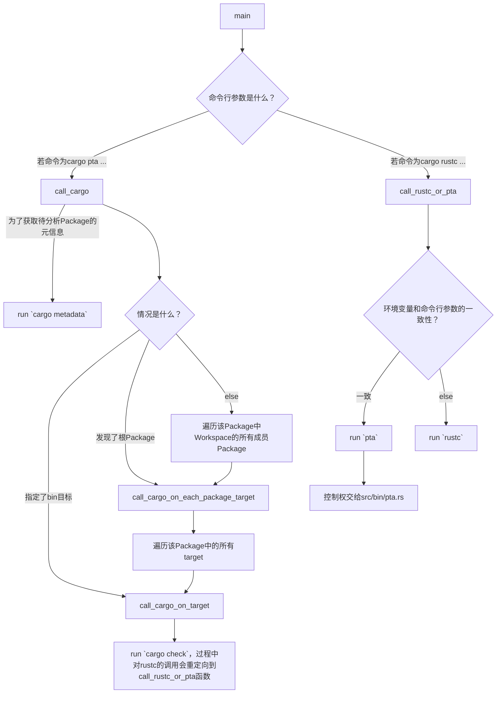
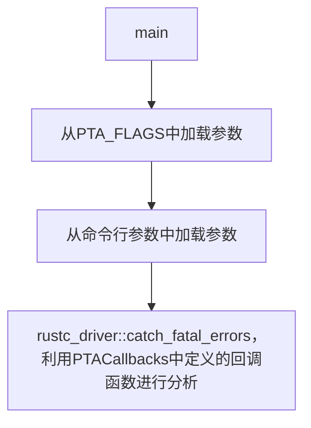

# Rupta代码阅读分析笔记

## rust-analyzer对rustc_private组件报红线的解决方案

[这个问答](https://users.rust-lang.org/t/rust-analyzer-fails-to-index-due-to-unresolved-external-crate-in-a-rustc-private-project/105909) 回答了Rust Analyzer对rustc_private组件报unresolve extern crate的解决方案，总结为4步：

1. 给rustup安装新组件，`rustup component add rustc-dev`

2. 在VS Code的设置中，将`rust-analyzer.rustc.source`设置为`discover`

3. 在当前`crate`包的`Cargo.toml`中填上这样两行：

   ```toml
   [package.metadata.rust-analyzer]
   rustc_private = true
   ```

4. 重启Rust Analyzer

## 入口在哪里？

通过`cargo metadata`命令获取关于Rupta crate的元信息。得知该crate有三个编译目标（target）：

- `src/lib.rs` (lib目标)
- `src/bin/cargo-pta.rs` (bin目标)
  - 分析Rust Package时使用的`cargo-pta pta ...`
- `src/bin/pta.rs` (bin目标)
  - 分析单个.rs文件时使用的`pta ...`

由于我们的需求是分析整个Rust Package，故我们的代码阅读分析笔记也将从该文件开始。

## `/src/bin/cargo-pta.rs`的分析



## `/src/bin/pta.rs`的分析



main(45)
AnalysisOptions::parse_from_args

## 总体修改思路
