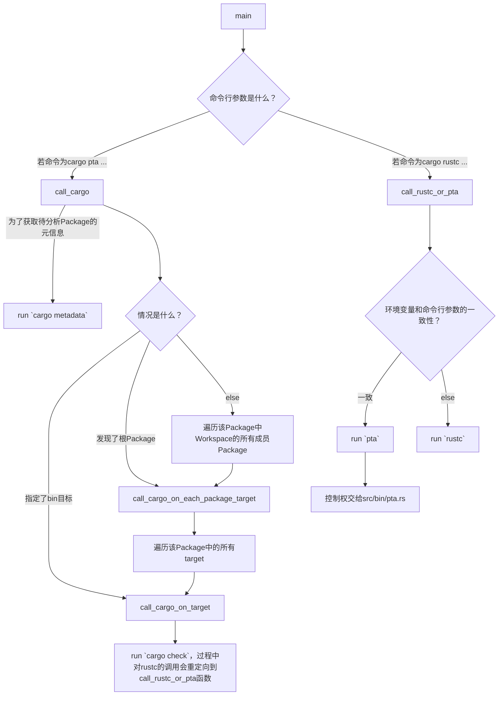
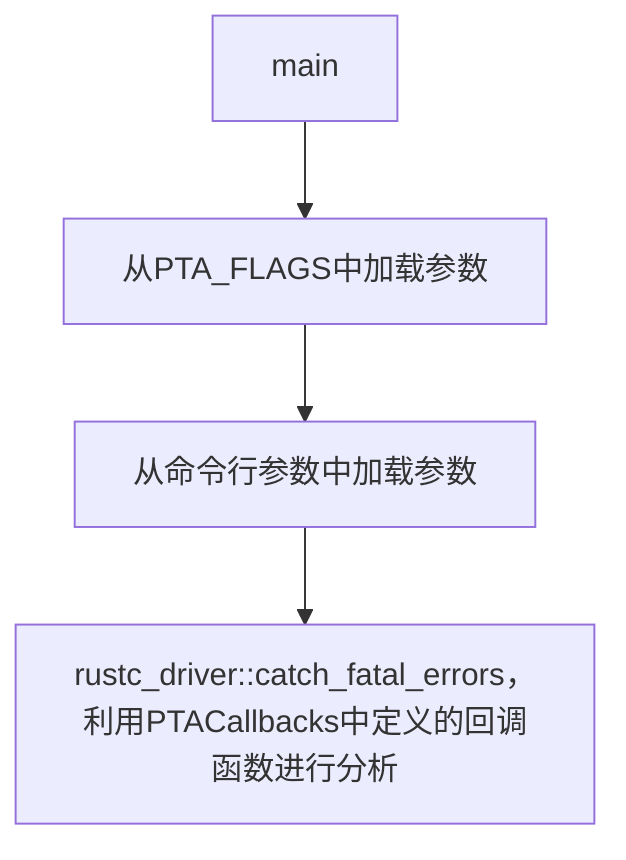

# Rupta代码阅读分析笔记

## rust-analyzer对rustc_private组件报红线的解决方案

[这个问答](https://users.rust-lang.org/t/rust-analyzer-fails-to-index-due-to-unresolved-external-crate-in-a-rustc-private-project/105909) 回答了Rust Analyzer对rustc_private组件报unresolve extern crate的解决方案，总结为4步：

1. 给rustup安装新组件，`rustup component add rustc-dev`

2. 在VS Code的设置中，将`rust-analyzer.rustc.source`设置为`discover`

3. 在当前`crate`包的`Cargo.toml`中填上这样两行：

   ```toml
   [package.metadata.rust-analyzer]
   rustc_private = true
   ```

4. 重启Rust Analyzer

## 入口在哪里？

通过`cargo metadata`命令获取关于Rupta crate的元信息。得知该crate有三个编译目标（target）：

- `src/lib.rs` (lib目标)
- `src/bin/cargo-pta.rs` (bin目标)
  - 分析Rust Package时使用的`cargo-pta pta ...`
- `src/bin/pta.rs` (bin目标)
  - 分析单个.rs文件时使用的`pta ...`

由于我们的需求是分析整个Rust Package，故我们的代码阅读分析笔记也将从该文件开始。

## `src/bin/cargo-pta.rs`的分析



## `src/bin/pta.rs`的分析



该文件的逻辑其实十分简单，其重点就在于`PTACallbacks`的定义，以及`rustc_driver::catch_fatal_errors`的调用。`PTACallbacks`定义于`src/pta/mod.rs`，因此需要进入这个文件进行分析。

## `src/pta/mod.rs`的分析

首先来看看`PTACallbacks`结构体的定义。它只有两个成员：

- `options`：是`AnalysisOptions`结构体，用于配置分析过程的参数。
- `file_name`：待分析（编译）的文件的路径。

简明易懂！然后我们再来看看它是如何实现`rustc_driver::Callbacks`需要的那些回调函数的。

- `config`回调函数：这个简单，接受一个`rustc_interface::interface::Config`参数，将自身的`file_name`设置为该参数记载的源文件名。例如`src/main.rs`。
- `after_analysis`回调函数：这个也很简单，接受一个`rustc_interface::interface::Compiler`参数和一个`rustc_interface::queries::Queries`，对前者进行错误检查（`abort_if_errors`），若无误则对后者执行`enter`方法。该方法接受一个闭包，该闭包接受一个`TyCtxt`，并运行`self.run_pointer_analysis`方法。

我们来瞅瞅`PTACallbacks::run_pointer_analysis`。
- 首先创建并启动了一个`rupta::util::mem_watcher::MemWatcher`。
  - 创建时，尝试获取当前内存占用，并存储到自身。若获取不到，则假设当前内存占用为0。
  - 启动时，每隔100毫秒收取一次系统当前内存占用，然后更新最大值。
- 若找不到入口函数则直接退出；否则构造一个`rupta::mir::analysis_context::AnalysisContext`。根据指定的PTA分析类型不同（CallSiteSensitive模式和Andersen模式）构造不同的分析器（分别是`rupta::pta::context_sensitive::ContextSensitivePTA`和`rupta::pta::andersen::AndersenPTA`），然后调用它们各自的`analyze`方法。


## 总体修改思路
