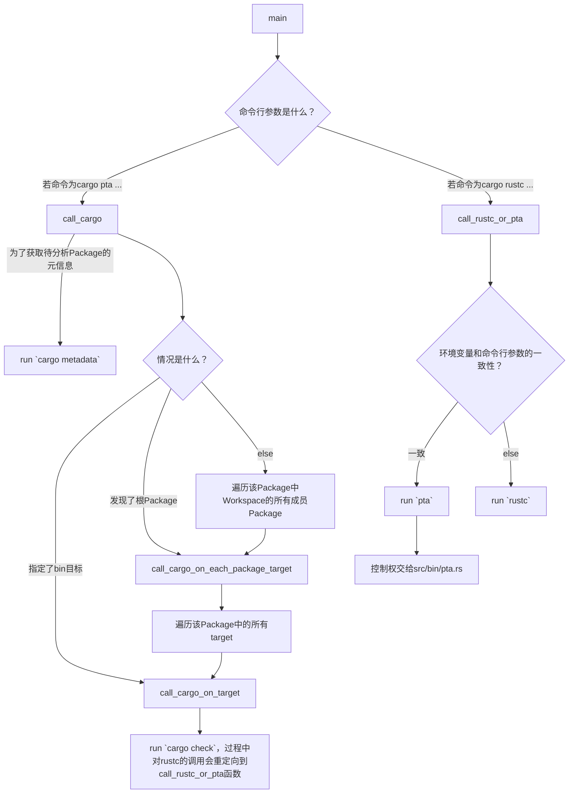
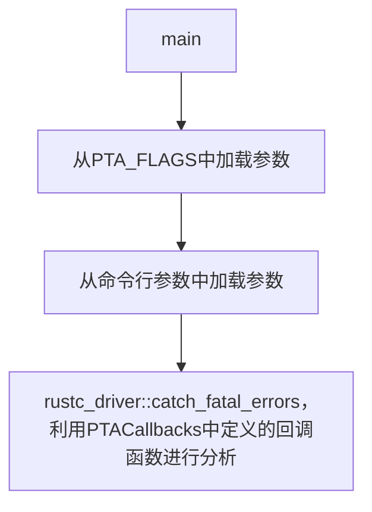

# Rupta代码阅读分析笔记

## rust-analyzer对rustc_private组件报红线的解决方案

[这个问答](https://users.rust-lang.org/t/rust-analyzer-fails-to-index-due-to-unresolved-external-crate-in-a-rustc-private-project/105909) 回答了Rust Analyzer对rustc_private组件报unresolve extern crate的解决方案，总结为4步：

1. 给rustup安装新组件，`rustup component add rustc-dev`

2. 在VS Code的设置中，将`rust-analyzer.rustc.source`设置为`discover`

3. 在当前`crate`包的`Cargo.toml`中填上这样两行：

   ```toml
   [package.metadata.rust-analyzer]
   rustc_private = true
   ```

4. 重启Rust Analyzer

## 自顶向下分析思路

通过`cargo metadata`命令获取关于Rupta crate的元信息。得知该crate有三个编译目标（target）：

- `src/lib.rs` (lib目标)
- `src/bin/cargo-pta.rs` (bin目标)
  - 分析Rust Package时使用的`cargo-pta pta ...`
- `src/bin/pta.rs` (bin目标)
  - 分析单个.rs文件时使用的`pta ...`

## `src/bin/cargo-pta.rs`的分析

按照自顶向下分析思路，我们从这个文件开始分析。



## `src/bin/pta.rs`的分析



该文件的逻辑其实十分简单，其重点就在于`PTACallbacks`的定义，以及`rustc_driver::catch_fatal_errors`的调用。`PTACallbacks`定义于`src/pta/mod.rs`，因此需要进入这个文件进行分析。

## `src/pta/mod.rs`的分析

首先来看看`PTACallbacks`结构体的定义。它只有两个成员：

- `options`：是`AnalysisOptions`结构体，用于配置分析过程的参数。
- `file_name`：待分析（编译）的文件的路径。

简明易懂！然后我们再来看看它是如何实现`rustc_driver::Callbacks`需要的那些回调函数的。

- `config`回调函数：这个简单，接受一个`rustc_interface::interface::Config`参数，将自身的`file_name`设置为该参数记载的源文件名。例如`src/main.rs`。
- `after_analysis`回调函数：这个也很简单，接受一个`rustc_interface::interface::Compiler`参数和一个`rustc_interface::queries::Queries`，对前者进行错误检查（`abort_if_errors`），若无误则对后者执行`enter`方法。该方法接受一个闭包，该闭包接受一个`TyCtxt`，并运行`self.run_pointer_analysis`方法。

我们来瞅瞅`PTACallbacks::run_pointer_analysis`。
- 首先创建并启动了一个`rupta::util::mem_watcher::MemWatcher`。
  - 创建时，尝试获取当前内存占用，并存储到自身。若获取不到，则假设当前内存占用为0。
  - 启动时，每隔100毫秒收取一次系统当前内存占用，然后更新最大值。
- 若找不到入口函数则直接退出；否则构造一个`rupta::mir::analysis_context::AnalysisContext`。根据指定的PTA分析类型不同（CallSiteSensitive模式和Andersen模式）构造不同的分析器（分别是`rupta::pta::context_sensitive::ContextSensitivePTA`和`rupta::pta::andersen::AndersenPTA`），然后调用它们各自的`analyze`方法。

## `src/pta/context_sensitive.rs`的分析

前文提及的`ContextSensitivePTA`分析器结构体的本质是这样定义的：

```rust
pub type CallSiteSensitivePTA<'pta, 'tcx, 'compilation> = ContextSensitivePTA<'pta, 'tcx, 'compilation, KCallSiteSensitive>;
```

也就是说，为`ContextSensitivePTA`的策略（Strategy）泛型参数填入这个`KCallSiteSensitive`即可获得一个`CallSiteSensitivePTA`。上文提及，构造了一个`CallSiteSensitivePTA`之后马上调用了它的`analyze`方法。这个方法内容很简单，除了计时以外，就只做了三件事：`initialize`，`propagate`和计时结束后的`finalize`。

> 由于我们是想从输出的函数调用图入手，查看这个图中的信息是如何一步步被加入的，从而在加入信息的过程中补充加入更多信息，达到获取分析所需信息的目的，因此有必要从函数调用图的生成开始逆向寻找这个往调用图中加信息的过程。
>
> 首先通过查看输出的日志（`PTA_LOG=debug cargo pta ...`）发现有一行这个：`[2024-06-17T13:31:27Z INFO  rupta::util::results_dumper] Dumping call graph...`。搜索可知这行INFO是在`src/util/results_dumper.rs`文件中定义的`dump_results`函数输出的。
>
> 知道了生成调用图的位置，我们可以继续往上追踪到`src/pta/context_sensitive.rs`的`ContextSensitivePTA::finalize`方法中。这个方法只干两件事情：输出函数调用图，输出PTA分析统计结果。
>
> 继续往上追踪，发现这个`finalize`方法在`impl PointerAnalysis for ContextSensitivePTA`的`analyze`方法中被调用。后者的构成在上文中已经讨论完毕。因此，有必要分析调用图数据结构`self.call_graph`是如何在`initialize`和`propagate`方法中被修改的了。

### `initialize`方法及其修改计划

该方法对`self.call_graph`做的唯一改动是增加了入口函数所代表的节点。我们可以以这里为突破口，尝试获取关于函数的更多信息，例如：

- 函数所在的源文件是哪个？
- 函数所属的crate叫什么？
- 函数所属的crate的Cargo.toml文件在哪里？

注意到有一个叫做`AnalysisContext::get_func_id`的方法，它接收一个`DefId`和一个奇怪的泛型参数列表（目前意义不明），能够计算返回一个FuncId。我们去看看这个方法的工作逻辑是怎样的，说不定能受到启发。

在src/pta/context_sensitive.rs的process_reach_funcs中加了输出。

run_pointer_analysis(66)
rupta::pta::context_sensitive::ContextSensitivePTA::{new, analyze}

## 总体修改思路
