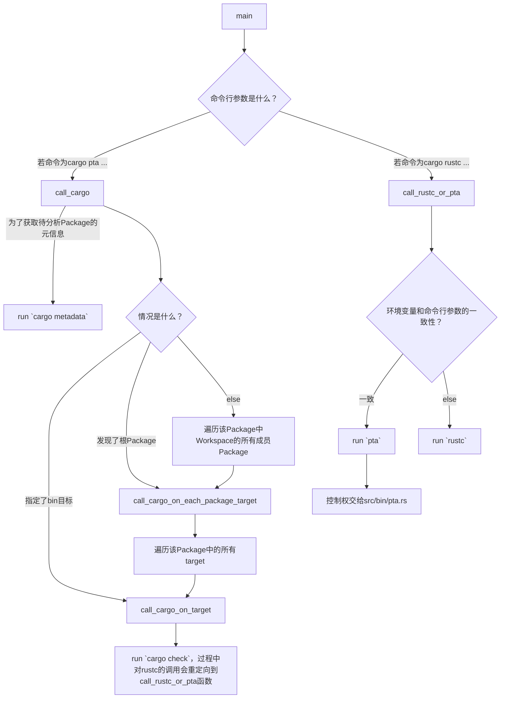
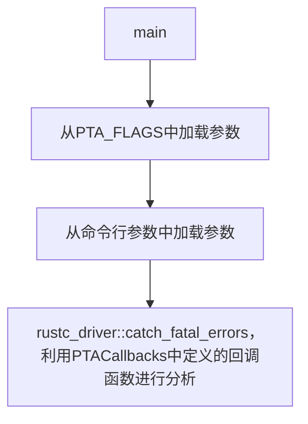
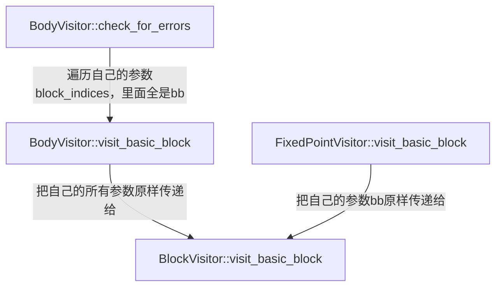
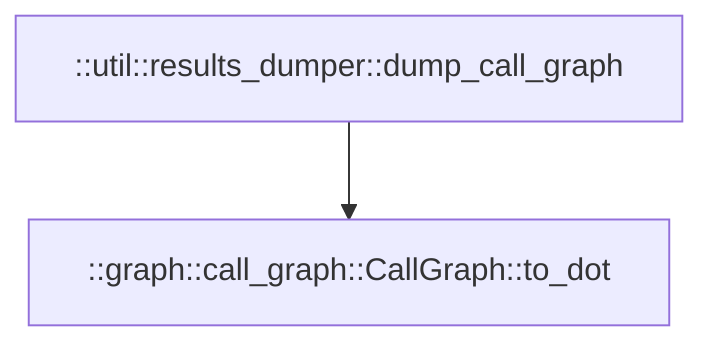

# Rupta代码阅读分析笔记

## rust-analyzer对rustc_private组件报红线的解决方案

[这个问答](https://users.rust-lang.org/t/rust-analyzer-fails-to-index-due-to-unresolved-external-crate-in-a-rustc-private-project/105909) 回答了Rust Analyzer对rustc_private组件报unresolve extern crate的解决方案，总结为4步：

1. 给rustup安装新组件，`rustup component add rustc-dev`

2. 在VS Code的设置中，将`rust-analyzer.rustc.source`设置为`discover`

3. 在当前`crate`包的`Cargo.toml`中填上这样两行：

   ```toml
   [package.metadata.rust-analyzer]
   rustc_private = true
   ```

4. 重启Rust Analyzer

## 自顶向下分析思路

通过`cargo metadata`命令获取关于Rupta crate的元信息。得知该crate有三个编译目标（target）：

- `src/lib.rs` (lib目标)
- `src/bin/cargo-pta.rs` (bin目标)
  - 分析Rust Package时使用的`cargo-pta pta ...`
- `src/bin/pta.rs` (bin目标)
  - 分析单个.rs文件时使用的`pta ...`

## `src/bin/cargo-pta.rs`的分析

按照自顶向下分析思路，我们从这个文件开始分析。



## `src/bin/pta.rs`的分析



该文件的逻辑其实十分简单，其重点就在于`PTACallbacks`的定义，以及`rustc_driver::catch_fatal_errors`的调用。`PTACallbacks`定义于`src/pta/mod.rs`，因此需要进入这个文件进行分析。

## `src/pta/mod.rs`的分析

首先来看看`PTACallbacks`结构体的定义。它只有两个成员：

- `options`：是`AnalysisOptions`结构体，用于配置分析过程的参数。
- `file_name`：待分析（编译）的文件的路径。

简明易懂！然后我们再来看看它是如何实现`rustc_driver::Callbacks`需要的那些回调函数的。

- `config`回调函数：这个简单，接受一个`rustc_interface::interface::Config`参数，将自身的`file_name`设置为该参数记载的源文件名。例如`src/main.rs`。
- `after_analysis`回调函数：这个也很简单，接受一个`rustc_interface::interface::Compiler`参数和一个`rustc_interface::queries::Queries`，对前者进行错误检查（`abort_if_errors`），若无误则对后者执行`enter`方法。该方法接受一个闭包，该闭包接受一个`TyCtxt`，并运行`self.run_pointer_analysis`方法。

我们来瞅瞅`PTACallbacks::run_pointer_analysis`。
- 首先创建并启动了一个`rupta::util::mem_watcher::MemWatcher`。
  - 创建时，尝试获取当前内存占用，并存储到自身。若获取不到，则假设当前内存占用为0。
  - 启动时，每隔100毫秒收取一次系统当前内存占用，然后更新最大值。
- 若找不到入口函数则直接退出；否则构造一个`rupta::mir::analysis_context::AnalysisContext`。根据指定的PTA分析类型不同（CallSiteSensitive模式和Andersen模式）构造不同的分析器（分别是`rupta::pta::context_sensitive::ContextSensitivePTA`和`rupta::pta::andersen::AndersenPTA`），然后调用它们各自的`analyze`方法。

## `src/pta/context_sensitive.rs`的分析

前文提及的`ContextSensitivePTA`分析器结构体的本质是这样定义的：

```rust
pub type CallSiteSensitivePTA<'pta, 'tcx, 'compilation> = ContextSensitivePTA<'pta, 'tcx, 'compilation, KCallSiteSensitive>;
```

也就是说，为`ContextSensitivePTA`的策略（Strategy）泛型参数填入这个`KCallSiteSensitive`即可获得一个`CallSiteSensitivePTA`。上文提及，构造了一个`CallSiteSensitivePTA`之后马上调用了它的`analyze`方法。这个方法内容很简单，除了计时以外，就只做了三件事：`initialize`，`propagate`和计时结束后的`finalize`。

> 由于我们是想从输出的函数调用图入手，查看这个图中的信息是如何一步步被加入的，从而在加入信息的过程中补充加入更多信息，达到获取分析所需信息的目的，因此有必要从函数调用图的生成开始逆向寻找这个往调用图中加信息的过程。
>
> 首先通过查看输出的日志（`PTA_LOG=debug cargo pta ...`）发现有一行这个：`[2024-06-17T13:31:27Z INFO  rupta::util::results_dumper] Dumping call graph...`。搜索可知这行INFO是在`src/util/results_dumper.rs`文件中定义的`dump_results`函数输出的。
>
> 知道了生成调用图的位置，我们可以继续往上追踪到`src/pta/context_sensitive.rs`的`ContextSensitivePTA::finalize`方法中。这个方法只干两件事情：输出函数调用图，输出PTA分析统计结果。
>
> 继续往上追踪，发现这个`finalize`方法在`impl PointerAnalysis for ContextSensitivePTA`的`analyze`方法中被调用。后者的构成在上文中已经讨论完毕。因此，有必要分析调用图数据结构`self.call_graph`是如何在`initialize`和`propagate`方法中被修改的了。

## 总体修改思路

之前，在开题报告中，我们说过我们希望我们的分析工具可以给出如下信息：

```json
{
  "crates": [
    {
      "crate_name": ...,
      "manifest_path": ...
    }, ...
  ],
  "callables": [
    {
      "belongs_to_crate_idx": ...,
      "source_file_path": ...,
      "line_number": ...
    }, ...
  ],
  "calls": [
    {
      "caller_idx": ...,
      "callee_idx": ...
    }, ...
  ]
}
```

我们的总体思路是：

1. crate的信息，总体的信息可以用`cargo metadata`获取，某个函数所属的crate也可以用`src/builder/fpag_builder.rs`的`FuncPAGBuilder::new`中的方法查询到。
2. callables的信息，在`src/builder/fpag_builder.rs`中，也是利用`FuncPAGBuilder::new`中的方法收集完全了，只不过需要和上一步crate信息对上
3. calls中的信息来源也被解决，来自`src/pta/context_sensitive.rs`中的`ContextSensitivePTA::add_call_edge`函数，它能知晓调用者和被调用者各自的DefId。

### MIRAI的借鉴

由于MIRAI能够输出函数所在的源代码文件路径，而Rupta没有这个机能，所以需要借鉴一下MIRAI是怎么做这件事情的。

根据之前的调研，MIRAI会收集一个数组，内部的元素长这样：`(rustc_span::Span, (DefId, DefId))`，表示在Span中发生了第一个DefId函数调用第二个DefId函数的情况。结果发现可以这样获取函数调用发生的源代码路径：

```rust
// loc的类型就是rustc_span::Span
let source_loc = loc.source_callsite();
if let Ok(line_and_file) = source_map.span_to_lines(source_loc) {
  // line_and_file的类型是FileLines
  // pub struct FileLines {
  //   pub file: Lrc<SourceFile>,
  //   pub lines: Vec<LineInfo>,
  //}
  // 现在已经可以得知该语句的位置了。
}
```

由于我们关心的是函数**定义**发生的位置而不是调用，这里的代码撑死了只能给我们一些方向性的参考。而目前的主要矛盾是：这个`rustc_span::Span`的信息到底是在哪一步中收集获得的呢？

经过简单的搜索，我们发现原来上述`(rustc_span::Span, (DefId, DefId))`信息是通过`CallGraph::CallGraph`方法加入到调用图中的，而后者在`call_visitor.rs`的第349行被调用了。我们马上直奔那里一探究竟。

`CallVisitor::get_function_summary`中调用了上述加入新调用关系的方法。解读该函数发现信息来源是这样构成的：

- 调用发生的位置`loc`来自于`CallVisitor`实例自身的`bv.current_span`，其中`bv`是个`BodyVisitor`。
- 调用者的位置，即第一个`DefId`来自于`CallVisitor`实例自身的`bv.def_id`。结合MIR的特性很容易明白，实际上MIR中的每个Body就是一个函数。因此`bv.def_id`就是当前正在被分析的函数（即调用者caller）的`DefId`。
- 被调用者的位置，即第二个`DefId`来自于函数传入的参数。我们可以暂且不管这个东西。

#### 如何获取一个函数的`DefId`？

于是，我们很好奇这个`bv`中的`def_id`是怎么获得的呢？于是跳转到该结构体的定义中一看，原来它的`DefId`是从构造函数中传进来的，不是自己分析获得的。没事，看看谁调用了`BodyVisitor::new`呢？一搜索发现有两处：

- 一处在`CallVisitor::create_and_cache_function_summary`中，如果发现被调用者有MIR表示，就新建一个`BodyVisitor`去分析被调用者的函数调用情况去了。这里`def_id`的来源很明了，就是被调用者的`def_id`。
- 另一处在`CrateVisitor::analyze_body`中，这儿的`def_id`仍然是外界传进来的，搜索发现这个`analyze_body`方法是在`CrateVisitor::analyze_some_bodies`方法中**计算**获得的，好家伙终于找到源头了！！

我们重点关注后者的`DefId`是怎么计算获得的。我们发现有几处不同的计算`DefId`的方法：

- 通过分析入口函数找到入口函数的`DefId`
  ```rust
  // Get the entry function
  let entry_fn_def_id = if let Some((def_id, _)) = self.tcx.entry_fn(()) {
      def_id
  } else {
      DefId::local(DefIndex::from_u32(0))
  };
  ```
  这儿的`self.tcx`的类型是`TyCtxt<'tcx>`，其来源即为`rustc_driver::Callbacks`中`after_analysis`方法回调函数中，对其传入的参数`queries`经处理后调用`enter`方法时，传递给闭包的第一个参数，也就是说这个`tcx`是编译器给出的一手信息，未经过MIRAI二次处理。
- 通过遍历HIR的BodyOwners获取各个Body的`DefId`
  ```rust
  for local_def_id in self.tcx.hir().body_owners() {
    let def_id = local_def_id.to_def_id();
    // -- snip --
    self.analyze_body(def_id);
  }
  ```

至此，我们把如何获得一个函数的`DefId`的方法梳理完成了。总结起来，大致是如下流程：

1. 从回调函数`after_analysis`的参数`rustc_interface::queries::Queries`，调用其`.global_ctxt().unwrap().enter(|tcx| {...})`方法。
2. 对那个闭包中的`tcx`，调用迭代器`.hir().body_owners()`，每次迭代都能获得一个`LocalDefId`。
3. 最后使用`LocalDefId::to_def_id()`方法获得`DefId`。

#### 如何获取函数调用发生时的Span信息？

于是，我们很好奇这个`bv`中的`current_span`是怎么获得的呢？于是我们回归到`BodyVisitor`的定义中，尝试寻找对`self.current_span`的赋值发生在哪里？

第一处赋值发生在`BodyVisitor::new`方法中，但这次赋值只是给它赋值了一个全0的默认值，没有任何意义：

```rust
return BodyVisitor {
  // -- snip --
  current_span: rustc_span::DUMMY_SP,
  // -- snip --
}
```

除此以外，还有一个`BodyVisitor::reset_visitor_state`方法会将`self.current_span`重置为全0值。以上两个对`self.current_span`的赋值都不是我们要找的东西。

实际上，真正能够更新这个值的代码在这两个地方：

- `BodyVisitor::visit_statement`，它长这样
  ```rust
  fn visit_statement(&mut self, location: mir::Location, statement: &mir::Statement<'tcx>) {
    debug!("env {:?}", self.bv.current_environment);
    self.bv.current_location = location;
    let mir::Statement { kind, source_info } = statement;
    // 其中，source_info的数据类型是 &rustc_middle::mir::SourceInfo
    self.bv.current_span = source_info.span;
    // -- snip --
  }
  ```
- `BodyVisitor::visit_terminator`，它长这样
  ```rust
  fn visit_terminator(
    &mut self,
    location: mir::Location,
    kind: &mir::TerminatorKind<'tcx>,
    source_info: mir::SourceInfo,
  ) {
    debug!("env {:?}", self.bv.current_environment);
    self.bv.current_location = location;
    self.bv.current_span = source_info.span;
    // -- snip --
  }
  ```

我们以前者为例分析这个`SourceInfo`的信息是从哪里来的。由函数签名可知这个`SourceInfo`是从函数参数中的`statement`提取得来，于是我们想知道这个`statement`是从哪里来的。追踪`visit_statement`方法可知其在`visit_basic_block`中被调用，而后者的运行逻辑大概是这样的：

```rust
pub fn visit_basic_block(
  &mut self,
  bb: mir::BasicBlock,
  terminator_state: &mut HashMap<mir::BasicBlock, Environment>,
) {
  let mir::BasicBlockData {
    ref statements,
    ref terminator,
    ..
  } = &self.bv.mir[bb];
  let mut location = bb.start_location();
  let terminator_index = statements.len();

  if !self.bv.check_for_errors {
    while location.statement_index < terminator_index {
      self.visit_statement(location, &statements[location.statement_index]);
      check_for_early_return!(self.bv);
      location.statement_index += 1;
    }
    // -- snip --
  }
  // -- snip --
}
```

用文字描述这个过程就是：

1. 这个函数接收了一个基本块，`bb: rustc_middle::mir::BasicBlock`，并利用之从`self.bv.mir`中索引到了该基本块的信息，其中就包含了该基本块中的所有**语句**组成的数组**statements**。
2. 声明一个可变变量`location`，初始化为该基本块的起始位置。
3. 利用上述变量进行索引，调用前文提及的`self.visit_statement`遍历该基本块中的所有语句，方法就是`statements[location.statement_index]`。

**这就引出了另一个问题**：`self.bv.mir`**又是从哪里来的**？通过阅读代码知道这个东西只在`BodyVisitor`的构造函数中发生过唯一一次赋值，而这个构造函数的唯一参数就是一个`BodyVisitor`，由此这个问题就转变为了：`BodyVisitor`的`mir`成员是从哪里来的？

这个问题在`BodyVisitor::new`中得到了解答，这个构造函数接收一个Body的`DefId`然后构造一个`BodyVisitor`实例，而这个`Body`的`mir`成员则是从`tcx`中获得的：

```rust
pub fn new(
  crate_visitor: &'analysis mut CrateVisitor<'compilation, 'tcx>,
  def_id: DefId,
  // -- snip --
) -> BodyVisitor<'analysis, 'compilation, 'tcx> {
  let tcx = crate_visitor.tcx;
  // --snip --
  let mir = if tcx.is_const_fn_raw(def_id) {
    tcx.mir_for_ctfe(def_id)
  } else {
    let def = rustc_middle::ty::InstanceDef::Item(def_id);
    tcx.instance_mir(def)
  };
  // --snip --
}
```

由此我们可以知道，`BodyVisitor::mir`可以通过给定一个`TyCtxt`和`DefId`唯一确定，其确定算法即为上述代码。虽然不知道它的实际含义，但是照猫画虎还是比较简单的。

**还有一个问题没解决：这个**`bb`**又是怎么来的**？这就必须追踪`BlockVisitor::visit_basic_block`的调用链了。经过搜索，发现是这样的：



其中左边那个`check_for_errors`分支的调用有两处，而且这两处都长成一个样子：

```rust
fixed_point_visitor.bv.check_for_errors(
  &fixed_point_visitor.block_indices,
  &mut fixed_point_visitor.terminator_state,
);
```

显然装着一堆`bb`的`block_indices`是从`FixedPointerVisitor`那边搞来的。

右边那个`FixedPointVisitor::visit_basic_block`的`bb`来源也是一样，最终都指向了`FixedPointerVisitor`的`block_indices`成员。于是问题就转变成了：这个成员是在哪里赋值的？结果在`FixedPointerVisitor::new`中发现了端倪：这个构造函数接受一个`BodyVisitor`，并直接

```rust
let dominators = body_visitor.mir.basic_blocks.dominators();
let (block_indices, loop_anchors) = get_sorted_block_indices(body_visitor.mir, dominators);
```

后边那个函数只是对基本块做了一下拓扑排序而已，本质上`bb`的来源就是`BodyVisitor::mir::basic_blocks`罢了。而`BodyVisitor::mir`的来源，上文已经分析过了。

归总一下，如何获得一条语句的Span信息：

1. 首先获得函数的`DefId`。结合`queries...enter(|tcx| {...})`回调函数给的`tcx`参数，可以获得该函数的MIR，记为`mir`。
2. 直接从`mir.basic_blocks`获取该函数所包含的全部基本块。
3. 对每一个基本块`bb`，利用`mir[bb]`获取其包含的语句数组`statements`，并对每个语句`stmt`调用`let mir::Statement { kind, source_info } = statement;`解包获得`source_info`信息。
4. 最后，利用`source_info.span`获得语句的位置。
5. 进一步地，可以从Span信息获得源文件路径和在文件中的行号信息。
  ```rust
  // loc的类型就是rustc_span::Span
  let source_loc = loc.source_callsite();
  if let Ok(line_and_file) = source_map.span_to_lines(source_loc) {
    // line_and_file的类型是FileLines
    // pub struct FileLines {
    //   pub file: Lrc<SourceFile>,
    //   pub lines: Vec<LineInfo>,
    //}
    // 现在已经可以得知该语句的位置了。
  }
  ```

### Callable的信息从哪里来？

在总体思路中，我们准备使用 `src/builder/fpga_builder.rs` 中的 `FuncPAGBuilder` 类来获取可达函数的 `DefId` ，从而进一步获得可达函数的信息。但是在实际操作中发现，利用这个方法获得的可达函数 **少于** 输出的JSON文件中 `calls` 字段出现的函数数量。因此，有必要寻找一个更为准确的统计手段。

查阅Rupta分析结束时的输出，会发现形如如下几行的统计信息：

```
##########################################################
Call Graph Statistics:
#Reachable functions (CS): 30656
#Reachable functions (CI): 11244
#Reachable unmonomorphized functions (CI): 4450
#Call graph edges (CS): 65349
#Call graph edges (CI): 30655
#Statically resolved calls: 30403
...
```

其中的Reachable functions几项引起了我们的注意。在Rupta的源代码中搜索，会发现CS、CI两项分别来自这两处：

- CS
  ```rust
  call_graph.reach_funcs.len()
  ```
- CI
  ```rust
  let mut ci_reach_funcs: HashSet<FuncId> = HashSet::new();
  let mut reach_funcs_defids: HashSet<DefId> = HashSet::new();
  for func in call_graph.reach_funcs.iter() {
      let ci_func_id = func.func_id;
      ci_reach_funcs.insert(ci_func_id);
      let func_ref = acx.get_function_reference(ci_func_id);
      reach_funcs_defids.insert(func_ref.def_id);
  }
  let num_reach_funcs_defids = reach_funcs_defids.len();
  let num_ci_reach_funcs = ci_reach_funcs.len();
  ```

不难观察到，CI就是去重版的CS。我们只需取用CI统计的数据即可。

最后，将收集信息的流程放到了 `src/pta/context_sensitive.rs` 的 `ContextSensitivePTA::finalize` 函数中。

```rust
impl ContextSensitivePTA {
    pub fn finalize(&mut self) {
        // calculate reachable functions and insert them into self.acx.overall_metadata.func_metadata
        let mut reach_funcs_defids: HashSet<DefId> = HashSet::new();
        for func in self.call_graph.reach_funcs.iter() {
            let ci_func_id = func.func_id;
            let func_ref = self.acx.get_function_reference(ci_func_id);
            reach_funcs_defids.insert(func_ref.def_id);
        }
        // 将统计可达函数的过程从FuncPAGBuilder::new搬到这里
        for def_id in reach_funcs_defids.iter() {
            let func_metadata = FuncMetadata::from_info(self.acx, *def_id);
            self.acx.overall_metadata.func_metadata.insert(func_metadata);
        }
        // -- snip --
    }
}
```

### Crate信息从哪里来？

Rupta和MIRAI都没有非常仔细地收集有关Crate的信息，MIRAI的`CrateVisitor`也未能提供任何帮助。

我们的目标是：在浏览所有函数的时候，都得知道这个函数属于具体的哪个Crate，这个Crate的Cargo.toml文件在哪里（以此指代该Crate的路径）。

经过搜索，以下代码可以实现这样的功能，它位于`src/builder/fpag_builder.rs`的`FuncPAGBuilder::new`函数中。

```rust
// 整一份当前上下文的拷贝。
let cur_tcx = acx.tcx.clone(); // cur_tcx: TyCtxt<'tcx>
// 获取一些关于当前函数DefId和所属crate的信息
let def_id_of_func = func_ref.def_id.clone();
let crate_index_num = def_id_of_func.krate;
// 有crate的名字，但是没有版本号
let crate_name = cur_tcx.crate_name(crate_index_num);
// 当前编译会话里能找到函数所在的文件的信息
let cur_session = acx.tcx.sess;
let source_map = cur_session.source_map();
let span = cur_tcx.def_span(def_id_of_func);
let file = source_map.lookup_source_file(span.lo());
// 沃趣，找到了这个函数定义在哪个文件里头！！！！
let filename = file.name.clone();
// filename的类型是rustc_span::FileName，它是个枚举。这里极大概率出现的是Real类型。
// Real类型也是个枚举，在此处最常见的两种Real枚举类型是Remapped和LocalPath。
// Real(Remapped { local_path: Some("/home/endericedragon/.rustup/toolchains/nightly-2024-02-03-x86_64-unknown-linux-gnu/lib/rustlib/src/rust/library/core/src/ops/range.rs"), virtual_name: "/rustc/bf3c6c5bed498f41ad815641319a1ad9bcecb8e8/library/core/src/ops/range.rs" })
// Real(LocalPath("/home/endericedragon/playground/example_crate/fastrand-2.1.0/src/lib.rs"))
// 枚举的其他类型均定义于rustc_span/src/lib.rs
let file_path = match filename {
    FileName::Real(real_file_name) => match real_file_name {
        RealFileName::LocalPath(path_buf) => {
            get_cargo_toml_path_from_source_file_path_buf(path_buf)
        }
        RealFileName::Remapped {
            local_path: path_buf_optional,
            virtual_name: _virtual_path_buf, // 我们不关心虚拟路径，直接弃用
        } => {
            if let Some(path_buf) = path_buf_optional {
                get_cargo_toml_path_from_source_file_path_buf(path_buf)
            } else {
                String::from("Virtual")
            }
        }
    },
    _ => String::from("Other"),
};
println!("crate_name: {}, crate path: {:?}", crate_name, file_path);

// -- snip --
/// 和真正的文件系统交互，从源代码文件逐层向上查找直至找到第一个Cargo.toml，以定位该Crate的路径。
fn get_cargo_toml_path_from_source_file_path_buf(file_path: PathBuf) -> String {
    let mut path = file_path;
    while let Some(parent) = path.parent() {
        if parent.join("Cargo.toml").exists() {
            return parent.to_path_buf().to_string_lossy().into();
        }
        path = parent.to_path_buf();
    }

    unreachable!()
}
```

### calls的信息从哪里来？

Rupta和MIRAI都提供了绘制函数调用图的功能，说明他们均有数据结构存储函数调用关系。我们抽丝剥茧，看看具体是怎么实现的。

首先是输出`.dot`文件的地方。



通过观察上述函数的源代码，不难发现有个表征函数调用图中“函数调用关系”的结构体`CallGraphEdge`，而函数调用图的边恰好就是用来体现函数之间调用关系的！

继续阅读，发现这个`CallGraphEdge`是对任意实现了`::graph::call_graph::CGCallsite` trait的类型的简单包装。不过这不是最重要的，最重要的是我们发现了两个方法，这两个方法对于在调用图中增加一条边是有用的，即定义在`CallGraph`上的：

- `pub fn get_callees(&self, callsite: &S) -> HashSet<F>`方法
- `pub fn add_edge(&mut self, callsite: S, caller_id: F, callee_id: F) -> bool`方法。

这儿的泛型参数详细为：`F: CGFunction`、`S: CGCallSite`。

其中，后者真正进行了边的创建、边编号`EdgeIdx`的申请和更新调用图中的信息等事务。根据后者的调用情况，我们可以给出结论：这些调用边并非在全部计算完成之后再加入调用图，而是一边计算一边加入调用图的。因此，想要知道函数的调用信息，有两个做法：

1. 修改`CallGraphEdge`，使得它能容纳我们想要的信息（caller、callee的唯一标识，并且尽可能直观）
2. 新增数据结构，记录我们想要的信息（比较麻烦，没必要，不推荐）

然而存在一个问题：函数调用图中，是用FuncId或者CSFuncId指代某个函数的。但是在MIR中，是用DefId指代某个函数。这中间一定存在某种转换关系，即我们想将FuncId转换为DefId。这要怎么做呢？

根据Rupta代码的启示，确认了可以这样做：

```rs
// 已知acx: AnalysisContext
let func_ref = acx.get_function_reference(func_id);
let func_def_id = func_ref.def_id;
```

利用上述原理，很容易改造`::pta::context_sensitive::ContextSensitivePTA::add_call_edge`为如下的样子：

```rs
fn add_call_edge(&mut self, callsite: &Rc<CSCallSite>, callee: &CSFuncId) {
    let caller = callsite.func;
    if !self.call_graph.add_edge(callsite.into(), caller, *callee) {
        return;
    }
    // 利用acx把FuncId转换为DefId，这样函数的所有信息都能知道
    let caller_ref = self.acx.get_function_reference(caller.func_id);
    let caller_def_id = caller_ref.def_id;
    let callee_ref = self.acx.get_function_reference(callee.func_id);
    let callee_def_id = callee_ref.def_id;
    println!("{:?} --> {:?}", caller_def_id, callee_def_id);
    // 以下部分掌管比较细化的边，例如从实参指向形参的边，
    // 和从返回值指向存储返回值的变量的有向边，
    // 我们可以暂时不管。
    let new_inter_proc_edges = self.pag.add_inter_procedural_edges(self.acx, callsite, *callee);
    for edge in new_inter_proc_edges {
        self.inter_proc_edges_queue.push(edge);
    }
}
```

函数的调用双方在`add_call_edge`方法中全都知道了。但是函数调用发生在哪个文件的第几行中呢？

首先，注意到`add_call_edge`函数中传入的参数`callsite: &Rc<CSCallSite>`，其内有一个字段`location: rustc_middle::mir::Location`，看名字应该是能知道这个call site的具体位置的。但是，如何利用这个信息进行查找呢？

根据搜索结果，办法如下：

```rs
// 这就是callsite参数的location字段
let call_location = callsite.location;
// 由于函数调用一定是发生在caller里，因此
// 需要获得caller的mir
let caller_mir = self.acx.tcx.optimized_mir(caller_def_id);
// 利用mir获得callsite的位置
// let call_span = caller_mir.source_info(call_location).span;
// ! 之前的call_span的获得方法有问题，现在好了
let call_block = &caller_mir.basic_blocks[call_location.block];
let call_span = if call_location.statement_index < call_block.statements.len() {
    call_block.statements[call_location.statement_index].source_info.span
} else {
    call_block.terminator().source_info.span
};
// 为获得行号信息，需要一个source_map
let source_map = self.acx.tcx.sess.source_map();
// match一下两种情况，Ok就是又有文件路径又有行号，Err就是只有文件路径（估计还是虚拟路径）
match source_map.lookup_line(call_span.lo()) {
    Ok(source_and_line) => {
        let source_file = source_and_line.sf;
        // 别忘记，这儿的行号和列号全是从0开始的
        let line_number = 1 + source_and_line.line;
        println!(
            "Callsite: {:?} calls {:?} at {:?} line {}",
            caller_ref.to_string(),
            callee_ref.to_string(),
            source_file.name,
            line_number
        );
    }
    Err(_) => ()
}
```

### 如何输出信息到文件？

先回顾一下我们需要的信息，以及它们分别分布在什么地方。

1. crate的信息，总体的信息可以用`cargo metadata`获取，某个函数所属的crate也可以用`src/builder/fpag_builder.rs`的`FuncPAGBuilder::new`中的方法查询到。
2. callables的信息，在`src/builder/fpag_builder.rs`中，也是利用`FuncPAGBuilder::new`中的方法收集完全了，只不过需要和上一步crate信息对上
3. calls中的信息来源也被解决，来自`src/pta/context_sensitive.rs`中的`ContextSensitivePTA::add_call_edge`函数，它能知晓调用者和被调用者各自的DefId。

#### Rupta自己是如何输出信息的？

Rupta输出信息的总出口位于`src/util/results_dumper.rs`的`dump_result`函数中，函数签名如下：

```rs
pub fn dump_results<P: PAGPath, F, S>(
    acx: &AnalysisContext,
    call_graph: &CallGraph<F, S>,
    pt_data: &DiffPTDataTy,
    pag: &PAG<P>,
) where
    F: CGFunction + Into<FuncId>,
    S: CGCallSite + Into<BaseCallSite>,
    <P as PAGPath>::FuncTy: Ord + std::fmt::Debug + Into<FuncId> + Copy
{
    // --snip --
}
```

其函数签名中的`acx`很难不引起注意，它的类型是`AnalysisContext`，内含许多分析工作所必须的数据结构（例如`TyCtxt`）。它还存储了分析结果输出的路径，例如其中的：

```rs
if let Some(pts_output) = &acx.analysis_options.pts_output {
    info!("Dumping points-to results...");
    dump_ci_pts(acx, pt_data, pag, pts_output);
    // dump_pts(pt_data, pag, pts_output);
}
```

很显然，`pts_output`就是运行rupta时传入的命令行参数中，指定的PTS输出路径。同时，函数还接收了一大堆参数（`call_graph, pt_data`）等。这些才是真正输出到调用图中去的信息。它们是谁给的呢？原来是`ContextSensitivePTA`：

```rs
impl<...> ContextSensitivePTA<...> {
    pub fn finalize(&self) {
        // dump call graph, points-to results
        results_dumper::dump_results(self.acx, &self.call_graph, &self.pt_data, &self.pag);

        // dump pta statistics
        let pta_stat = ContextSensitiveStat::new(self);
        pta_stat.dump_stats();
    }
}
```

很显然，是在分析过程中，`ContextSensitivePTA`把分析结果存储于自身，然后在结束分析时调用了`dump_results`进行分析结果的存储的。

那么，为了输出函数调用信息和所属`crate`信息，可以将上述信息直接放进`AnalysisContext`中。由于Rupta的几乎每个分析有关的函数都会以一个`AnalysisContext`作为第一个参数，因此在这里存储结果是相对容易实现的。

#### 将函数及其所属crate信息输出到文件

于是，增添rupta的代码，最终改动情况如下：

1. 新建了模块`info_collector`，在其中定义了`CrateMetadata`和`FuncMetadata`两个结构体，前者唯一标识一个`crate`，后者唯一标识一个函数。
2. 在`AnalysisContext`中新增了一个`func_metadata: HashSet<FuncMetadata>`字段，存储`FuncPAGBuilder`计算获得的所有`FuncMetadata`。
3. `FuncPAGBuilder::new`中计算获得构造`FuncMetadata`所需的所有信息，构造后者并加入`AnalysisContext.func_metadata`中。
4. `src/info_collector/mod.rs`中，用`serde`给`FuncMetadata`等结构体实现了了`Serialize` trait。
5. `src/util/results_dumper.rs`的`dump_results`函数中，增加了输出`func_metadata`的语句。

#### 优化内存存储结构

在存储及输出函数及其所属Crate的过程中，每个`FuncMetadata`都会存储一个`CrateMetadata`结构。然而，一个crate中大概率有不止一个函数，这意味着相同内容的`CrateMetadata`会在数个`FuncMetadata`中存储多次。这样显然十分浪费内存。

一种想法自然是：开个数组存`CrateMetadata`，而只在`FuncMetadata`中存储这个`CrateMetadata`在数组中的下标。但是这个数组同时需要具有去重的功能，因为不同函数可以属于同一个Crate。

基于上述需求，设想并了一个结合`HashMap`和`Vec`的新数据结构`VecSet`，它的定义长这样：

```rs
pub struct VecSet<T: Eq + Hash> {
    // 真正存储数据的数组
    data: Vec<Rc<T>>,
    // 记录每个数据项在数组中的下标，用于去重
    included: HashMap<Rc<T>, usize>,
}
```

使用`Rc<T>`，可以有效避免同一份数据项存储两遍的问题。经过测试，使用`Rc<T>`的`VecSet`比未使用`Rc<T>`的朴素版本能节省将近一半的内存用量（1608KB 减小到 868KB）。

#### 将函数的调用情况输出到文件

和输出函数信息类似，如法炮制：

1. 在`info_collector`中定义`CallSiteMetadata`结构体，包含调用者和被调用者的DefId，以及调用发生所在的文件在文件系统中的路径、文件中的具体行号。同时为它实现`std::hash::Hash` trait和serde的`Serialize` trait。
2. 在`AnalysisContext`中新增了一个`callsite_metadata: HashSet<CallSiteMetadata>`。
3. `rupta::pta::context_sensitive::ContextSensitivePTA::add_call_edge`计算获得一次函数调用的具体信息，并以此构造`CallSiteMetadata`，加入`acx`中。
4. 在`result_dumpers`中输出这些信息。

#### TODO

下一步想做的事情：优化存储结构，因为很多函数同属于一个`crate`，但现在的存储结构会导致一个`crate`的`metadata`被存储好几遍导致内存占用过高。`Rupta`本身的内存占用已经很吓人了，再用这么劣质的存储结构只会雪上加霜。